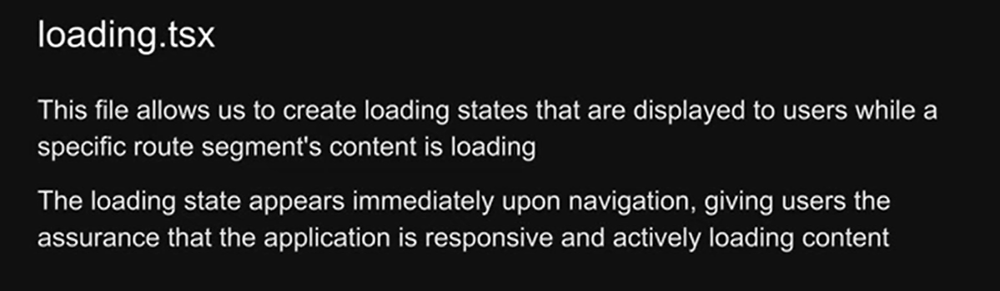

# Next.js

This repository is a comprehensive example using Next.js,

## Table of Contents

1. [Getting Started](#getting-started)
2. [Routing in Next.js](#routing-in-nextjs)
   - [Basic Routing](#basic-routing)
   - [Nested Routes](#nested-routes)
   - [Dynamic Routes](#dynamic-routes)
   - [Nested Dynamic Routes](#nested-dynamic-routes)
   - [Catch-All Segments](#catch-all-segments)
3. [Custom 404 Page](#custom-404-page)
4. [File Colocation](#file-colocation)
5. [Private Folders](#private-folders)
6. [Route Group](#)
7. [Layout and Nested Layout](#)
8. [Metadata](#)
9. [Navigation: Link component + Active Route + Programatic navigation](#)
10. [Template](#)
    
11. [loading UI](#)
    
12. [Error UI](#)
    
13. [component-hierargy](#)
    

## Getting Started

To get started with this project, clone the repository and install the dependencies:

```bash
git clone https://github.com/your-username/nextjs-routing-example.git
cd nextjs-routing-example
npm install
```
